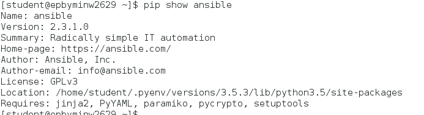
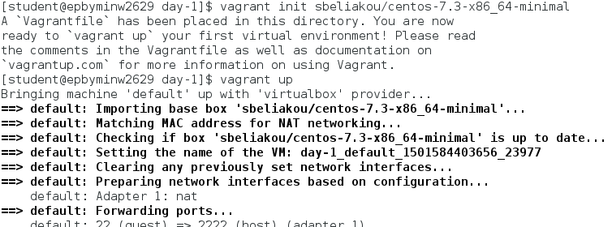
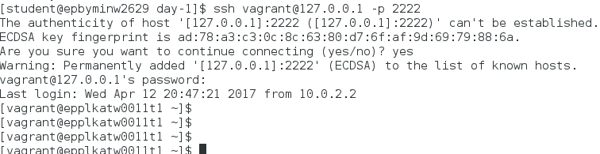
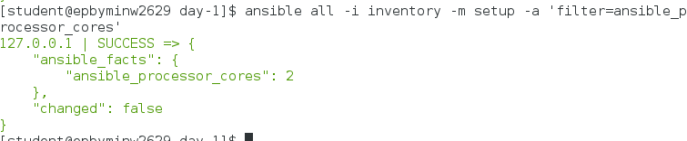
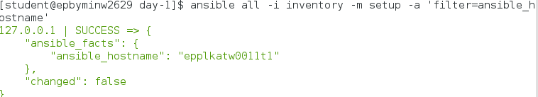
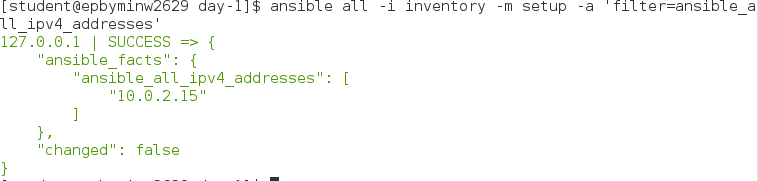
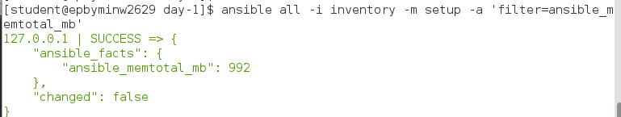
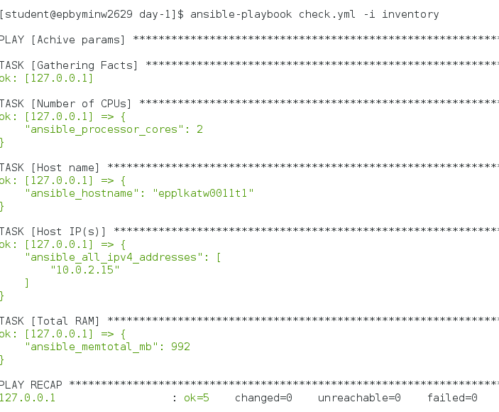
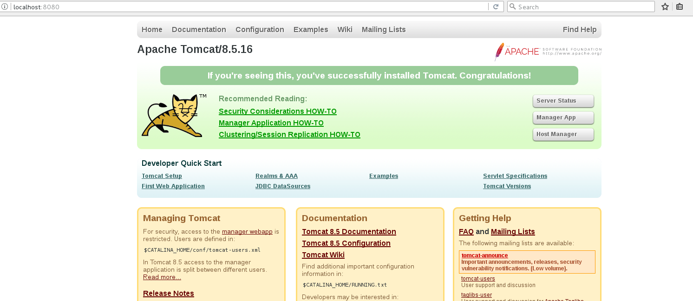
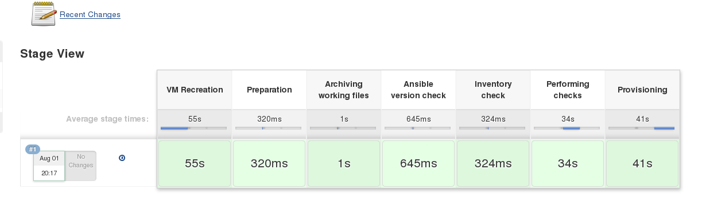

## 1. Install Ansible v2.3.1 with python pip. Report details where ansible has been installed.




## 2. Create folder ~/cm/ansible/day-1. All working files are supposed to be placed right there.

## 3. Spin up clear CentOS6 VM using vagrant (“vagrant init sbeliakou/centos-7.3-minimal”). Verify connectivity to the host using ssh keys (user: vagrant)



## 4. Create ansible inventory file (name: inventory) with remote host connection details:
### - Remote VM hostname/ip/port
### - Remote ssh login username
### - Connection type
```
[all]
127.0.0.1 ansible_connection=ssh ansible_ssh_user=vagrant ansible_port=2222 ansible_ssh_private_key_file=.vagrant/machines/default/virtualbox/private_key
```

## 5. Test ansible connectivity to the VM with ad-hoc command: 

### Find out host details:

### - Number of CPUs



### - Host name



### - Host IP(s)



### - Total RAM



### - Commom check via playbook
```yaml
- name: Achive params
  hosts: all
  
  tasks:
    - name: Number of CPUs
      debug: var=ansible_processor_cores

    - name: Host name
      debug: var=ansible_hostname

    - name: Host IP(s)
      debug: var=ansible_all_ipv4_addresses

    - name: Total RAM
      debug: var=ansible_memtotal_mb
```



## 6. Develop a playbook (name: tomcat_provision.yml) which is supposed to run against any host (specified in inventory)
### Use following modules (at least):
#### - copy
#### - file
#### - get_url
#### - group
#### - service
#### - shell
#### - unarchive
#### - user
#### - yum
### Define play variables (at least):
#### - tomcat_version
#### - java_version
### Every task should have a name section with details of task purpose.
### Examples:
#### - name: Ensure user student exists
#### - name: Fetch artifact form the Shared repository
### Ensure tomcat is up and running properly with module “shell” (at least 3 different checks).
### Second (and other) run(s) of playbook shouldn’t interrupt the service – one of checks should show tomcat uptime.


### tomcat_provision.yml:

```yaml
- name: tomcat deployment
  hosts: all
  
  vars:
    java_version: '1.8.0'
    tomcat_version: '8.5.16'
  
  become: true
  become_user: root

  tasks:
    - name: Installing JAVA
      yum:
        name: java-{{java_version}}-openjdk-devel
        state: present

    - name: Creating group
      group:
        name: tomcat_as_group
        state: present

    - name: Creating user
      user:
        name: tomcat_as
        shell: /bin/nologin

    - name: Creating directory
      file:
        path: /opt/tomcat/{{tomcat_version}}
        state: directory
        mode: 0755
        owner: tomcat_as
        group: tomcat_as_group
    
    - name: downloading tomcat
      get_url:
        url: http://ftp.byfly.by/pub/apache.org/tomcat/tomcat-8/v8.5.16/bin/apache-tomcat-8.5.16.tar.gz
        dest: /opt/tomcat/{{tomcat_version}}

    - name: Unpacking archive
      unarchive:
        src: /opt/tomcat/{{tomcat_version}}/apache-tomcat-8.5.16.tar.gz
        dest: /tmp
        remote_src: True

    - name: Copy tomcat to its place
      shell: cp -R /tmp/apache-tomcat-{{tomcat_version}}/* /opt/tomcat/{{tomcat_version}}

    - name: Creating directory
      file:
        path: /opt/tomcat/{{tomcat_version}}
        state: directory
        mode: 0755
        owner: tomcat_as
        group: tomcat_as_group
        recurse: True

    - name: Copying systemd script
      copy:
        src: tomcat.service
        dest: /etc/systemd/system/

    - name: Replacing my custom string
      replace:
        path: /etc/systemd/system/tomcat.service
        regexp: 'BLABLA'
        replace: '/opt/tomcat/{{tomcat_version}}'

    - name: Starting tomcat
      service:
        name: tomcat
        state: started
        enabled: True

    - name: Check availability via curl
      shell: if [[ $(curl -ILvk localhost:8080 | grep 200) > 0 ]] ; then echo "available via curl" ; else "Doesn't available via curl" ; fi

    - name: Check if java proc exists
      shell: if [[ $(pidof java) > 0 ]] ; then echo "Pid exists" ; else "Pid doesn't exist" ; fi

    - name: Check service status
      shell: if [[ $(systemctl status tomcat | grep "active (running)" )  > 0 ]] ; then echo "Service is active" ; else echo "Service not active" ; fi
```

### tomcat.service:

```
After=syslog.target network.target

[Service]
Type=forking

Environment=JAVA_HOME=/usr/lib/jvm/jre
Environment=CATALINA_PID=BLABLA/temp/tomcat.pid
Environment=CATALINA_HOME=BLABLA
Environment=CATALINA_BASE=BLABLA
Environment='CATALINA_OPTS=-Xms512M -Xmx1024M -server -XX:+UseParallelGC'
Environment='JAVA_OPTS=-Djava.awt.headless=true -Djava.security.egd=file:/dev/./urandom'

ExecStart=BLABLA/bin/startup.sh
ExecStop=/bin/kill -15 $MAINPID

User=tomcat_as
Group=tomcat_as_group
UMask=0007
RestartSec=10
Restart=always

[Install]
WantedBy=multi-user.target
```


## 7. Software installation requirements:
#### - Tomcat AS should be installed from sources (tar.gz) – download from the official site (http://archive.apache.org/dist/tomcat/).
#### - Tomcat AS should be owned (and run) by user tomcat_as:tomcat_as_group
#### - Tomcat AS version should be 8.x
#### - Tomcat installation folder (CATALINA_HOME) is /opt/tomcat/$version, where $version is the version of tomcat defined in playbook
#### - Java can be installed from CentOS Repositories




## 8. Verification Procedure: playbook will be checked by instructor’s CI system as follows:
#### 8.1 Connect to student’s host by ssh (username “student”) with own ssh key.
#### 8.2 Check the version of ansible installed on the system (as mentioned in point 1)
#### 8.3 Go into the folder mentioned in point 2
#### 8.4 Destroy/Launch VM: vagrant destroy && vagrant up
#### 8.5 Execute VM provisioning: ansible-playbook tomcat_provision.yml -i inventory -vv 
#### 8.6 If previous steps are done successfully, instructor will check the report


